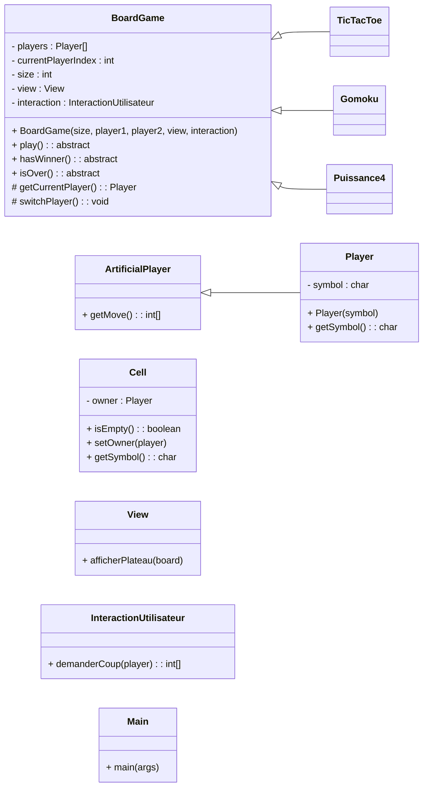

```mermaid
classDiagram
direction LR
    class BoardGame {
	    - players : Player[]
	    - currentPlayerIndex : int
	    - size : int
	    - view : View
	    - interaction : InteractionUtilisateur
	    + BoardGame(size, player1, player2, view, interaction)
	    + play() : abstract
	    + hasWinner() : abstract
	    + isOver() : abstract
	    # getCurrentPlayer() : Player
	    # switchPlayer() : void
    }

    class TicTacToe {
    }

    class Gomoku {
    }

    class Puissance4 {
    }

    class Player {
	    - symbol : char
	    + Player(symbol)
	    + getSymbol() : char
    }

    class ArtificialPlayer {
	    + getMove() : int[]
    }

    class Cell {
	    - owner : Player
	    + isEmpty() : boolean
	    + setOwner(player)
	    + getSymbol() : char
    }

    class View {
	    + afficherPlateau(board)
    }

    class InteractionUtilisateur {
	    + demanderCoup(player) : int[]
    }

    class Main {
	    + main(args)
    }

    BoardGame <|-- TicTacToe
    BoardGame <|-- Gomoku
    BoardGame <|-- Puissance4
    ArtificialPlayer <|-- Player


```
```mermaid
package gam
```